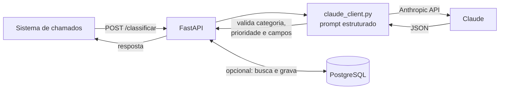

# 🤖 IA Triagem de Chamados

[](https://github.com/josecardosodev/nat-ia-triagem/actions/workflows/tests.yml)


API REST que usa **IA generativa (Claude, da Anthropic)** para fazer a triagem
automática de chamados técnicos: a partir da descrição em texto livre, sugere
**categoria, prioridade, resumo** e aponta **o que está faltando** no chamado.

## 💡 O problema

Em equipes de suporte, chamados chegam com descrições do tipo
*"projetor da sala 204 não liga, prova é amanhã"*. Antes de alguém começar a
resolver, um analista precisa ler, categorizar, definir prioridade e muitas vezes
voltar ao usuário para pedir informação que faltou. Essa triagem manual consome
tempo justamente de quem deveria estar atendendo.

Este serviço automatiza esse primeiro passo e pode ser chamado pelo sistema de
chamados no momento da abertura.

## ⚙️ Como funciona



**Exemplo:**

```bash
curl -X POST http://localhost:8000/classificar \
  -H "Content-Type: application/json" \
  -d '{"descricao": "Projetor da sala 204 não liga, prova é amanhã"}'
```

```json
{
  "categoria": "Provas",
  "prioridade": "Alta",
  "resumo": "Projetor com defeito na sala de prova agendada para o dia seguinte",
  "info_faltante": "nenhuma"
}
```

## 🛠️ Stack

| Camada | Tecnologia |
|---|---|
| API REST | FastAPI + Pydantic |
| IA generativa | Anthropic SDK (Claude) |
| Banco de dados | PostgreSQL (psycopg2) |
| Configuração | python-dotenv (variáveis de ambiente) |
| Qualidade | pytest, ruff, GitHub Actions |

## 🔒 Destaques técnicos

- **Saída do modelo validada**: a resposta da IA só é aceita se for JSON válido,
  com todos os campos e com categoria/prioridade dentro das listas permitidas.
  Tolera a resposta vir em bloco markdown.
- **Proteção contra SQL injection**: nome de tabela montado com
  `psycopg2.sql.Identifier` e valores sempre parametrizados.
- **Erros tratados por camada**: falha da IA vira `502`, falha de banco vira
  `500`, chamado inexistente vira `404`, entrada inválida vira `422`.
- **Credenciais fora do código**: tudo via `.env` (nunca versionado).
- **Testes sem custo**: a API do Claude e o banco são simulados nos testes, então
  a suíte roda no CI sem chave de API e sem PostgreSQL.

## 🚀 Como rodar

```bash
# 1. Criar ambiente e instalar dependências
python -m venv .venv
source .venv/bin/activate        # Windows: .venv\Scripts\activate
pip install -r requirements.txt

# 2. Configurar variáveis de ambiente
cp .env.example .env             # edite com sua chave da Anthropic e dados do banco

# 3. Subir a API
uvicorn main:app --reload --port 8000
```

Documentação interativa (Swagger): <http://localhost:8000/docs>

Para validar a integração com o Claude usando chamados de exemplo (usa a API real):

```bash
python scripts/classificar_exemplos.py
```

## 🧪 Testes

```bash
pip install -r requirements-dev.txt
pytest -v
ruff check .
```

## 📡 Endpoints

| Método | Rota | Descrição |
|---|---|---|
| `GET` | `/` | Status do serviço |
| `POST` | `/classificar` | Classifica uma descrição enviada no corpo da requisição |
| `POST` | `/classificar/{id}` | Busca o chamado no PostgreSQL, classifica e, com `?salvar=true`, grava o resultado no banco |

## 📁 Estrutura

```
├── main.py                  # API REST (FastAPI)
├── claude_client.py         # integração com o Claude + validação da resposta
├── database.py              # acesso ao PostgreSQL
├── config.py                # configuração via variáveis de ambiente
├── scripts/
│   └── classificar_exemplos.py
├── tests/                   # pytest (IA e banco simulados)
└── .github/workflows/       # CI: lint + testes em Python 3.11 e 3.12
```

## 🗺️ Próximos passos

- [ ] Autenticação na API (token) antes de expor em rede
- [ ] Endpoint para classificar chamados em lote
- [ ] Dockerfile para facilitar o deploy
- [ ] Métricas de acerto comparando a sugestão da IA com a classificação final do analista

## 👨‍💻 Autor

**José Cardoso** · Analista de Suporte N3 com 15+ anos em TI, desenvolvendo automações em Python.

[GitHub](https://github.com/josecardosodev)

---

Licença [MIT](LICENSE).
